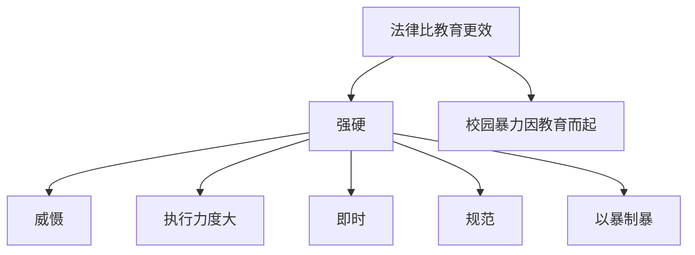
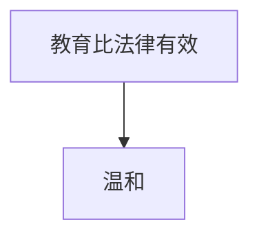
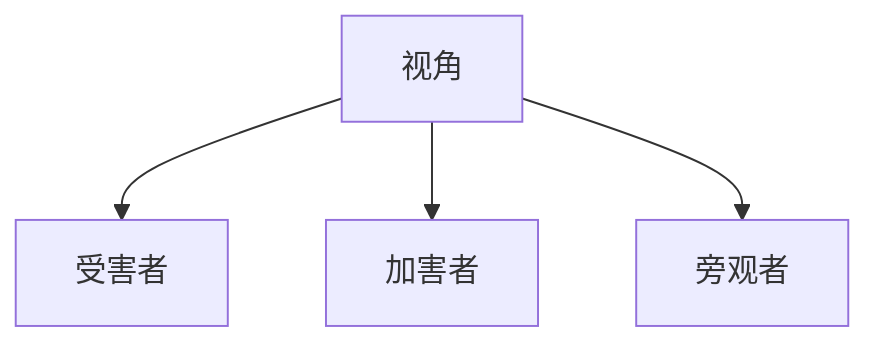

```mermaid
    graph TB

    法律比教育更效-->强硬-->威慑
    强硬-->执行力度大
    强硬-->即时
    强硬-->规范
    强硬-->以暴制暴

    法律比教育更效-->校园暴力因教育而起

    
    


```

```mermaid
    graph TB
    教育比法律有效 -->温和

```

```mermaid
    graph TB
    视角-->受害者
    视角-->加害者
    视角-->旁观者

    
```

# 20201114 
    问候环节 太尴尬了

    
## P 
### point
    生活质量
    健康
### problem 
    一辩没脱稿
    二辩没脱稿

## N
### point
    没论点

    失业率上升
### problem 
    一辩 不知道辩题
    二辩没脱稿
