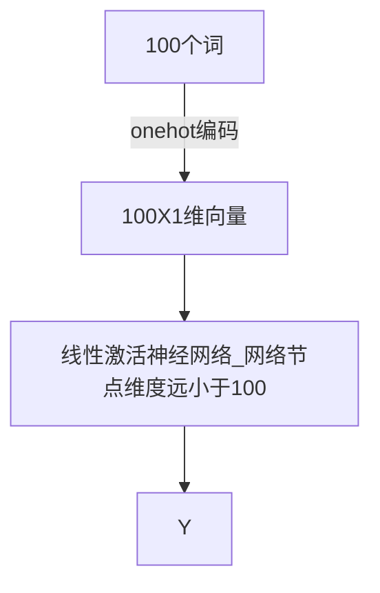

```mermaid
    graph TB
    100个词 -- onehot编码--> 100X1维向量 -->线性激活神经网络_网络节点维度远小于100 --> Y
```
# 网络实质
    网络每次输入一个向量，隐含层各节点的权重都会更新，将权重作为一个矩阵
    使用网络每输入一个向量，矩阵都会变化。
    使用这个权重矩阵来代替onehot矩阵，实质是对100维的onehot向量进行有损压缩，压缩到网络的维度。